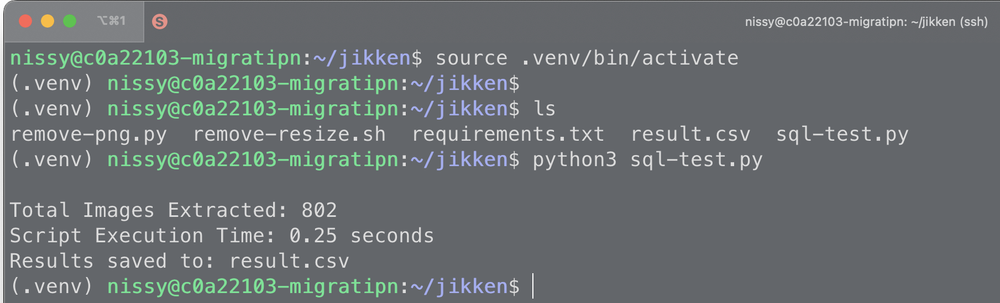

# MigrationFaster

このリポジトリには, WordPressの投稿コンテンツから画像ファイルを抽出し, 未使用の画像を削除するための2つのPythonプログラムが含まれています.

## プログラム一覧

1. `file-search.py`
2. `remove-png.py`

### 前提条件
Pythonの仮想環境をもちいて, 必要なパッケージをpipでインストールする必要があります.
```cmd
python3 -m venv .venv
source .venv/bin/activate

pip3 install -U pip
pip3 install -r requirements.txt
```

### file-search.py

このプログラムは, WordPressのMySQLデータベースから画像を含む投稿を検索し  
各投稿内の画像URLを抽出してCSVファイルに保存します.

#### 使用方法

1. プログラム内のデータベース接続情報を変更します
```Python
connection = pymysql.connect(
  host='YOUR_DATABASE_HOST',
  user='YOUR_DATABASE_USER',
  password='YOUR_DATABASE_PASSWORD',
  database='YOUR_DATABASE_NAME'
)
```

2. プログラムを実行します
```cmd
python file-search.py
```
 
3. result.csv という名前のCSVファイルに結果が保存されます
   プログラムの詳細
- WordPressデータベースに接続し, wp_postsテーブルから画像を含む投稿を取得します
- BeautifulSoupを使用してHTMLコンテンツから画像URLを抽出します
- 画像URLのうち, ~/uploads/ディレクトリ内のパスをCSVファイルに書き出します

#### 出力結果
```cmd
(.venv) nissy@c0a22103-migratipn:~/jikken$ python3 sql-test.py

Total Images Extracted: 802
Script Execution Time: 0.25 seconds
Results saved to: result.csv
```



### remove-png.py

このプログラムは, result.csvに記載された画像ファイル以外の画像をWordPressのuploadsディレクトリから削除します.

#### 使用方法

1. プログラム内のディレクトリパスとCSVファイルのパスを変更します.
```Python
uploads_dir = "/path/to/wp-content/uploads"
csv_file = "path/to/result.csv"
```

2. プログラムを実行します.
```cmd
python remove-png.py
```

3. 実行結果として, 削除されたファイルのリストが表示されます.
プログラムの詳細
- result.csvから使用中の画像ファイルパスを読み込み, セットに保存します
- uploadsディレクトリを再帰的に走査し, CSVに含まれない画像ファイルを削除します
- 削除されたファイルのリストと実行時間を表示します


#### 出力結果


出力量が多いため, 一部のみ掲載します.
```cmd
/tmp/var/www/html/wp-content/uploads/2024/09/IMG_1388.jpg
/tmp/var/www/html/wp-content/uploads/2024/09/IMG_7372.jpg
/tmp/var/www/html/wp-content/uploads/2024/09/ブログ用-1-1040x603.jpg
/tmp/var/www/html/wp-content/uploads/2024/09/IMG_7373-600x449.jpg
/tmp/var/www/html/wp-content/uploads/2024/09/IMG_4483-2-1024x768.png
/tmp/var/www/html/wp-content/uploads/2024/09/IMG_2276-1-1536x2048.jpg
/tmp/var/www/html/wp-content/uploads/2024/09/IMG_1071-1-300x225.jpg
/tmp/var/www/html/wp-content/uploads/2024/09/IMG_2257-150x150.jpg
/tmp/var/www/html/wp-content/uploads/2024/09/IMG_2475-1-1536x1152.jpg
/tmp/var/www/html/wp-content/uploads/2024/09/ブログ用_2-1024x768.jpg
/tmp/var/www/html/wp-content/uploads/2024/09/PXL_20240917_054149842-edited-2048x2048.jpg
/tmp/var/www/html/wp-content/uploads/2024/09/1726559483432-1-768x432.jpg
/tmp/var/www/html/wp-content/uploads/2024/09/PXL_20240917_064048550-1040x1849.jpg
/tmp/var/www/html/wp-content/uploads/2024/09/PXL_20240917_052951963.jpg
/tmp/var/www/html/wp-content/uploads/2024/09/ブログ用-1-600x348.jpg
/tmp/var/www/html/wp-content/uploads/2024/09/PXL_20240917_054149842-edited-600x600.jpg
/tmp/var/www/html/wp-content/uploads/2024/09/1726559483432-1024x576.jpg
/tmp/var/www/html/wp-content/uploads/2024/09/IMG_2475-1.jpg
/tmp/var/www/html/wp-content/uploads/2024/09/IMG_5611-1040x780.jpg
/tmp/var/www/html/wp-content/uploads/2024/09/IMG_1071-2048x1536.jpg
/tmp/var/www/html/wp-content/uploads/2024/09/IMG_1068-1-scaled.jpg
/tmp/var/www/html/wp-content/uploads/2024/09/PXL_20240917_052951963-edited-1536x1536.jpg
/tmp/var/www/html/wp-content/uploads/2024/09/IMG_1072.jpg
/tmp/var/www/html/wp-content/uploads/2024/09/ブログ用_2-2048x1536.jpg
/tmp/var/www/html/wp-content/uploads/2024/09/IMG_4483-3-300x225.png
/tmp/var/www/html/wp-content/uploads/2024/09/IMG_1071-1-1040x780.jpg
/tmp/var/www/html/wp-content/uploads/2024/09/ブログ用_2-1-150x150.jpg
/tmp/var/www/html/wp-content/uploads/2024/09/PXL_20240917_050645520-edited-150x150.jpg
/tmp/var/www/html/wp-content/uploads/2024/09/IMG_4483-1-1024x768.png
/tmp/var/www/html/wp-content/uploads/2024/09/PXL_20240917_050645520-150x150.jpg
/tmp/var/www/html/wp-content/uploads/2024/09/LINE_ALBUM_ICM_240929_1-600x1067.jpg
/tmp/var/www/html/wp-content/uploads/2024/09/1726559483184-1-300x169.jpg
/tmp/var/www/html/wp-content/uploads/2024/09/image-600x1176.png
/tmp/var/www/html/wp-content/uploads/2024/09/IMG_7372-1152x1536.jpg
/tmp/var/www/html/wp-content/uploads/2024/09/ブログ用-2048x1188.jpg
/tmp/var/www/html/wp-content/uploads/2024/09/PXL_20240917_054149842-edited-300x300.jpg
/tmp/var/www/html/wp-content/uploads/2024/09/PXL_20240917_065146385-edited-600x600.jpg
/tmp/var/www/html/wp-content/uploads/2024/09/IMG_2257.jpg
/tmp/var/www/html/wp-content/uploads/2024/09/1726559486252-2-600x338.jpg
/tmp/var/www/html/wp-content/uploads/2024/09/IMG_2475-1-600x450.jpg
/tmp/var/www/html/wp-content/uploads/2024/09/IMG_2754-edited-2048x2048.jpg
/tmp/var/www/html/wp-content/uploads/2024/09/IMG_7271-1040x1387.jpg
/tmp/var/www/html/wp-content/uploads/2024/09/IMG_7271-2-1536x2048.jpg
/tmp/var/www/html/wp-content/uploads/2024/09/IMG_1071-1-1536x1152.jpg
/tmp/var/www/html/wp-content/uploads/2024/09/ブログ用_2-1.jpg
/tmp/var/www/html/wp-content/uploads/2024/09/ブログ用_2-scaled.jpg
/tmp/var/www/html/wp-content/uploads/2024/09/ブログ用_2-1-768x576.jpg
/tmp/var/www/html/wp-content/uploads/2024/09/IMG_7271-2-225x300.jpg
/tmp/var/www/html/wp-content/uploads/2024/09/PXL_20240917_065146385-150x150.jpg
/tmp/var/www/html/wp-content/uploads/2024/09/ブログ用_2-1-scaled.jpg
/tmp/var/www/html/wp-content/uploads/2024/09/IMG_5610-150x150.jpg
/tmp/var/www/html/wp-content/uploads/2024/09/IMG_2475-scaled.jpg
/tmp/var/www/html/wp-content/uploads/2024/09/ブログ用_2-1-1040x780.jpg
/tmp/var/www/html/wp-content/uploads/2024/09/IMG_5611-1-600x450.jpg

Script Execution Time: 0.36 seconds
```


